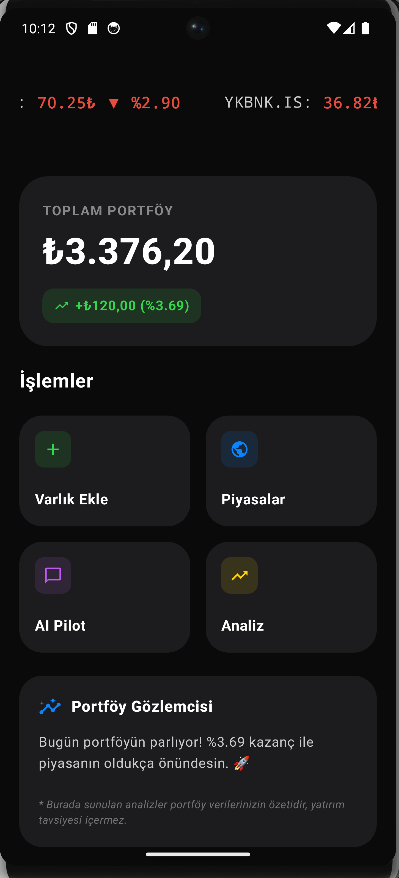
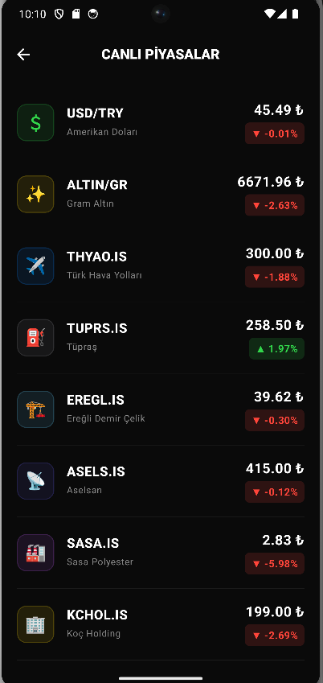
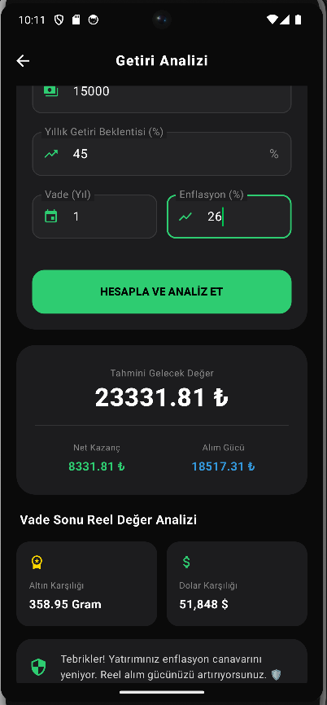
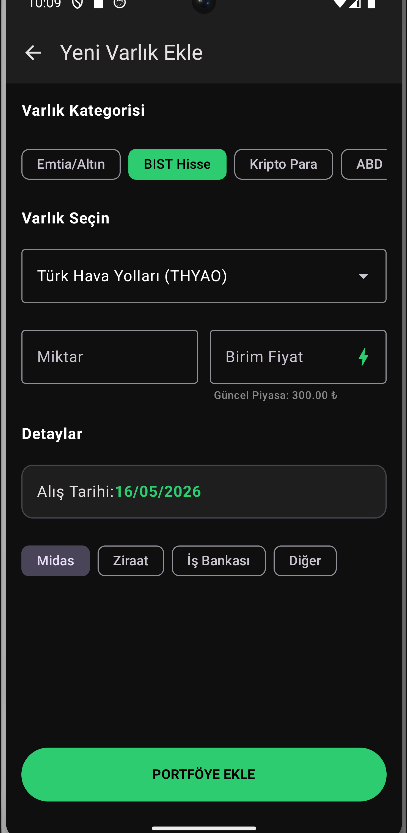
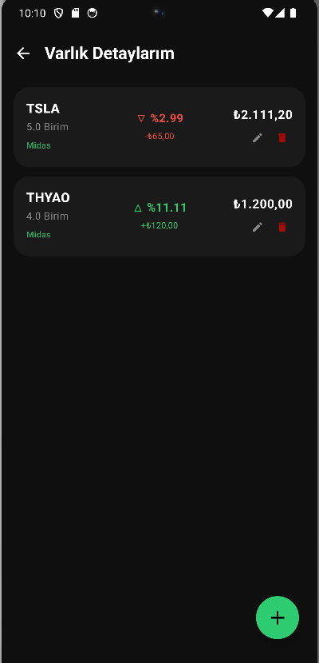
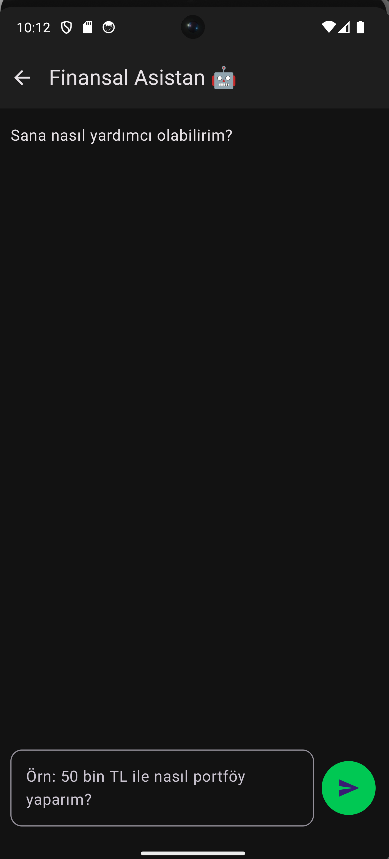

# 📊 FinMathAI: Yatırım Takip & Analiz (Modern Portfolio Navigator)

  
  
  
  

---

## 📝 Hakkında (About)
**FinMathAI**, (Google Play Store adıyla: Yatırım Takip & Analiz), Jetpack Compose mimarisi kullanılarak modern Android standartlarında geliştirilmiş dinamik bir kişisel finans, canlı piyasa takibi ve interaktif portföy yönetim uygulamasıdır. Kullanıcıların varlıklarını tek bir noktadan kurumsal düzeyde listelemesine, akan şeritlerle anlık fiyatları izlemesine ve portföylerine saniyeler içinde yeni işlemler eklemesine olanak tanır. Entegre finansal analiz motoru sayesinde, yatırımların enflasyon karşısındaki reel alım gücünü hesaplayarak stratejik karar destek mekanizması sunar.

> **FinMathAI** (Published on Google Play Store as: Yatırım Takip & Analiz), is a modern and dynamic personal finance, real-time market tracker, and interactive portfolio navigation application built entirely with **Jetpack Compose**. It enables users to monitor real-time asset prices via live ticker tapes, easily manage multi-asset portfolios, and execute detailed yield analytics. With its advanced calculation engine, FinMathAI analyzes investments against inflation rates to determine real purchasing power and future values.

---

## 📸 Ekran Görüntüleri (Screenshots)

| 📱 Ana Panel (Dashboard) | 🚀 Canlı Piyasalar | 📊 Getiri & Enflasyon Analizi |
| :---: | :---: | :---: |
|  |  |  |
| **Toplam Portföy Özet Ekranı** | **Anlık Döviz, Altın & Hisse Takibi** | **Reel Alım Gücü & Vade Sonu Analizi** |

| ➕ Yeni Varlık Ekleme | 📁 Varlık Detaylarım | 💬 Finansal Asistan |
| :---: | :---: | :---: |
|  |  |  |
| **Kategori ve Kurum Odaklı İşlem Girişi** | **Portföy İçi Kar/Zarar Listesi** | **Modüler Finansal Arayüz Paneli** |

---

## ✨ Öne Çıkan Özellikler (Key Features)

* **📈 Enflasyon Korumalı Getiri Analizi:** Yatırım parametrelerini (Anapara, Vade, Beklenen Getiri ve Enflasyon) harmanlayarak vade sonu tahmini gelecek değerini, net kazancını ve yatırımın enflasyon canavarını yenip yenemediğini (altın/dolar karşılıklarıyla) hesaplayan gelişmiş analiz motoru.
* **⚡ Canlı Piyasa Takibi (Real-time Tracker):** Uygulamanın üst kısmında kesintisiz akan dinamik piyasa şeridi ve USD/TRY, Altın, THYAO, TUPRS gibi popüler enstrümanların anlık fiyat değişimlerini gösteren kapsamlı piyasa ekranı.
* **➕ İnteraktif İşlem ve Varlık Girişi:** BIST Hisse, Kripto Para, ABD Hisse ve Döviz kategorilerinde; miktar, birim fiyat, alış tarihi ve aracı kurum (Midas, Ziraat, İş Bankası vb.) kırılımlarıyla portföye saniyeler içinde dinamik varlık ekleme formu.
* **🎨 Premium Dark UI:** Jetpack Compose teknolojisiyle örülmüş, göz yormayan, üst düzey kurumsal finans uygulamalarından ilham alan neon yeşili detaylı esnek modern koyu tema tasarımı.
* **🗄️ Çevrimdışı Öncelikli Mimari (Offline-First):** Room Veri Tabanı entegrasyonu sayesinde ağ bağlantısı kesilse bile kullanıcı portföyüne, varlık detaylarına ve işlem geçmişine kesintisiz, güvenli erişim.

---

## 🛠️ Teknik Stack (Tech Stack)

* **Language:** Kotlin (100% Modern, asynchronous ready)
* **UI Framework:** Jetpack Compose (Declarative UI layout, dynamic form handling)
* **Architecture:** MVVM (Model-View-ViewModel) & Clean Architecture principles
* **Dependency Injection:** Dagger-Hilt (Modular and testable component lifecycle)
* **Local Database:** Room DB (Secure encryption and offline caching for user portfolios)
* **Asynchronous Programming:** Kotlin Coroutines & Flow (Reactive UI streaming for market data)
